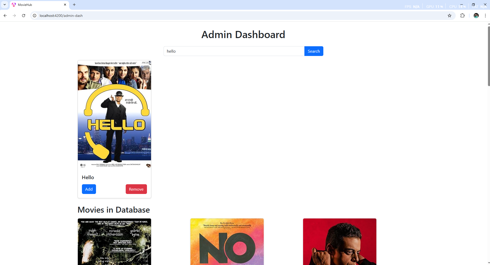

#  Movie Management App

  

A full-stack Movie Management application built with **Angular** for the frontend and **Spring Boot** for the backend. It allows users to browse movies, view details, and allows admins to manage movie data (add, remove).

  

---

  
  

##  Features

###  User
- Browse available movies
- View movie details in a modal popup

###  Admin
- Add new movies
- Delete movies
- View movie list in a dashboard

  

---

  

##  Tech Stack


###  Frontend

-  **Angular**

###  Backend
-  **Spring Boot**
-  **MYSQL** / **H2**

  
---

  

##  Getting Started
  

###  Backend Setup
  
1.  **Clone the repo**
```bash
git clone https://github.com/yourusername/movie-backend.git
```
#### run the project than run the sql script to add admin user to the system with username: admin and password: 111
###  forntend Setup
### run in your command line:
```bash
ng s
```
## Access UI

  - **App runs on: http://localhost:4200**


  

#  Movie Management App

  

  

A full-stack Movie Management application built with **Angular** for the frontend and **Spring Boot** for the backend. It allows users to browse movies, view details, and allows admins to manage movie data (add, remove).

  

  

---

  

  

##  Features

  

###  User

- Browse available movies

- View movie details in a modal popup

  

###  Admin

- Add new movies

- Delete movies

- View movie list in a dashboard

  

  

---

  

  

##  Tech Stack

  
  

###  Frontend

  

-  **Angular**

  

###  Backend

-  **Spring Boot**

-  **MYSQL** / **H2**

  

---

  

  

##  Getting Started

  

###  Backend Setup

1.  **Clone the repo**

```bash

git  clone  https://github.com/yourusername/movie-backend.git

```

####  run the project than run the sql script to add admin user to the system with username: admin and password: 111

###  forntend Setup

###  run in your command line:

```bash

ng  s

```

##  Access UI

  

-  **App runs on: http://localhost:4200**
## API Endpoints

The Movie Management API provides the following endpoints to interact with the movie data and authentication services.

### User Endpoints

| Method | Endpoint               | Description                  |
|--------|------------------------|------------------------------|
| `GET`  | `/api/movies`           | Get all movies               |
| `GET`  | `/api/movies/{id}`      | Get movie details by ID      |
| `GET`  | `/api/search`           | Search movies by title       |

### Admin Endpoints

| Method | Endpoint               | Description                  |
|--------|------------------------|------------------------------|
| `POST` | `/api/movies`           | Add a new movie              |
| `PUT`  | `/api/movies/{id}`      | Update a movie               |
| `DELETE` | `/api/movies/{id}`    | Delete a movie by ID         |

### Authentication Endpoints

| Method | Endpoint               | Description                  |
|--------|------------------------|------------------------------|
| `POST` | `/api/auth/register`    | Register a new user          |
| `POST` | `/api/auth/login`       | Login for an existing user   |

## Example Local Image





